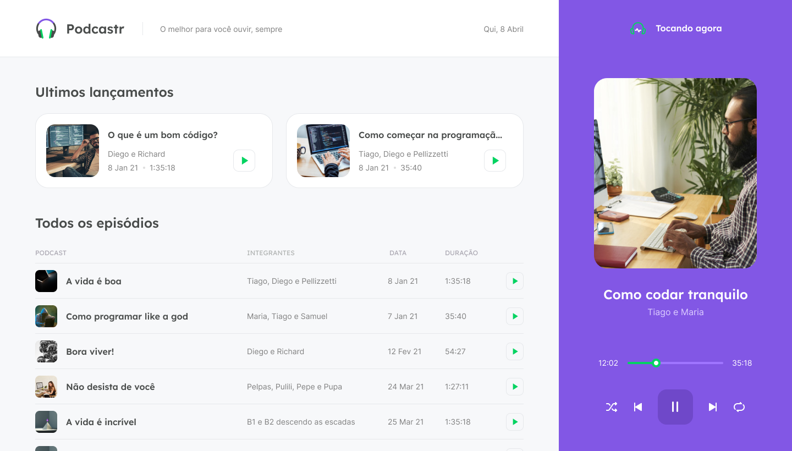

<h1 align="center">
    <br>
    
</h1>
<h4 align="center">
    Trilha ReactJS 
</h4>
<!-- <h4 align="center">Projeto web construído durante o Next Level Week #05-Discovery com a Rocketseat/DiegoFernandes.</h4> -->
<p align="center">
    
    <a aria-label="Completado" href="https://nextlevelweek.com/episodios/react/5/edicao/5">
        </img>
    </a>
    
    <a href="https://github.com/Dirosaki/Podcastr/blob/main/LICENSE">
        
    </a>
</p>
<p align="center">
    <a href="#podcastr-">Projeto</a>&nbsp;&nbsp;&nbsp;|&nbsp;&nbsp;&nbsp;
    <a href="#tecnologias-">Tecnologias</a>&nbsp;&nbsp;&nbsp;|&nbsp;&nbsp;&nbsp;
    <a href="#layout-">Layout</a>&nbsp;&nbsp;&nbsp;|&nbsp;&nbsp;&nbsp;
    <a href="#licença-%EF%B8%8F">Licença</a>
</p>


# Podcastr 
Projeto desenvolvido para escutar seus podcasts. Projeto realizado na NLW#5 @Rocketseat.

##### O melhor para você ouvir, sempre. 🎧🎶

<br>

## Funcionalidades
* Escutar podcast.
* Visualizar sobre o que se trata o podcast.
* Gerenciar podcasts.

## Features
```
✔ - Documentar o projeto
✖ - Responsividade
✖ - Dark Mode
✖ - Next PWA
✖ - Electron
```

## Tecnologias 🚀
Esse projeto foi desenvolvido com as seguintes tecnologias:
- [Html | 5](https://pt.wikipedia.org/wiki/HTML)
- [Sass | ^1.32.11](https://sass-lang.com/)
- [Typescript | ^4.2.4](https://www.typescriptlang.org/)
- [ReactJS | ^17.0.2](https://pt-br.reactjs.org/)
- [NextJS | ^10.1.3](https://nextjs.org/)

## Layout 🚧
### Desktop Screenshot
<div style="display: flex; flex-direction: 'column'; align-items: 'center';">
<!-- Responsive, 1440 x 900, 50% (Laptop L - 1440px)-->
    
    
    
</div>

### Mobile Screenshot
<div style="display: flex; flex-direction: 'row';">
<!-- Responsive, 425 x 900, 60% (Mobile L - 425px)-->
    Em breve...
    <!---->
    <!---->
    <!---->
</div>
<!--<a href="./.github/README-IMGS.md">Ver mais</a>-->
    <!-- IMGS
      ------------------------------
      home-without-podcast
      home-with-podcast
      ------------------------------
      podcast-information
      ------------------------------
    -->

## Rodando o projeto na sua maquina 🚴🏻‍♂️
<details>
    <summary>Dependências</summary>

```json
    "dependencies": {
        "axios": "^0.21.1",
        "date-fns": "^2.21.1",
        "next": "10.1.3",
        "rc-slider": "^9.7.2",
        "react": "17.0.2",
        "react-dom": "17.0.2",
        "sass": "^1.32.11"
    },
    "devDependencies": {
        "@types/node": "^14.14.41",
        "@types/react": "^17.0.3",
        "@types/react-dom": "^17.0.3",
        "json-server": "^0.16.3",
        "typescript": "^4.2.4"
    }
```
</details>

```bash
# Clone o repositório
$ git clone https://github.com/Dirosaki/Podcastr.git

# Acesse a pasta do projeto no prompt de comando
$ cd podcastr

# Instale as dependências
$ npm install

# Execute o script "dev"
$ npm run dev

# O projeto inciará na porta: 3000 - acesse http://localhost:3000
```

## Contribuição 💭
Para construir essa aplicação tive a ajuda do professor **Diego Fernandes** da Rocketseat que disponibilizou video aulas do projeto **Podcastr** e tive uma ajuda desta grande comunidade que a Rocketseat construiu no *Discord*.
Feito com ♥ by Rocketseat :wave: [Participe da nossa comunidade!](https://discord.gg/YxU7fJT)

## Licença ⚖️
Este projeto está sob a licença do MIT. Veja o arquivo [LICENSE](https://github.com/Dirosaki/Podcastr/blob/main/LICENSE) para mais detalhes.

## Contato ✉️
| <br><sub><a href="https://www.instagram.com/dirosaki">@dirosaki</a></sub> |
| :---: |